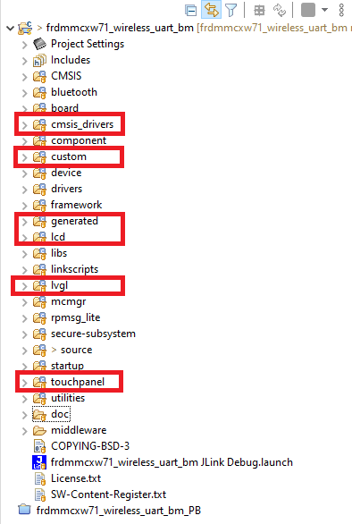

# NXP Application Code Hub
[](https://www.nxp.com)

## Driving LCD-PAR-S035 using LVGL on FRM-MCXW71 board

allows the user to interact with the device through a serial terminal and also it can be possible to see the commands pressed in the LCD through the IoT Toolbox using a Smartphone.

#### Boards: FRDM-MCXW71, FRDM-MCXW7X
#### Categories: Graphics, Industrial, Wireless Connectivity
#### Peripherals: DISPLAY, I2C, SPI, UART
#### Toolchains: MCUXpresso IDE

## Table of Contents
1. [Software](#step1)
2. [Hardware](#step2)
3. [Setup](#step3)
4. [Results](#step4)
5. [FAQs](#step5) 
6. [Support](#step6)
7. [Release Notes](#step7)

## 1. Software<a name="step1"></a>
This code has been implemented using MCUXpresso IDE v11.10, FRDM-MCXW71 SDk v2.16.0, LVGL v8.3.2 was used to generate the initial design. 

#### Note: 
*remember in order to use any wireless example in the MCXW71 you need to upload the NBU image. this image comes into the SDK version that you will use, in this case:*

- "SDK_2_16_FRDM-MCXW71-> middleware-> wireless-> ble_controller-> bin-> mcxw71_nbu_ble-..-.sb3"

## 2. Hardware<a name="step2"></a>
Purchase supported board:

- [FRDM-MCXW71](https://www.nxp.com/part/FRDM-MCXW71#/)
- [LCD-PAR-S035](https://www.nxp.com/part/LCD-PAR-S035#/)


## 3. Setup<a name="step3"></a>


### 3.1 Step 1
Import the project *"w_uart"* into MCUXpresso IDE by following the following sections of the "MCUXpresso IDE - User Guide" found in the documentation section of the [MCUXpresso IDE page](https://www.nxp.com/design/software/development-software/mcuxpresso-software-and-tools-/mcuxpresso-integrated-development-environment-ide:MCUXpresso-IDE)

### Note:  
*in order to see the Wireless UART on the IoT tool box change de GAP rol in the app: press SW4 and then SW2*


### 3.2 Step 2

Once you have imported the Wireless UART example in your workspace, the next step is to add the right configurations in order to enable the LCD, The following sections explain the main aspects that you should focus on:

To integrate the OTAP cLVGL service in your application, you must import additional software that is not included in other SDK examples by default. This step enables you to locate the files that you must merge in your project to support the LVGL service in your application.

!

The folders and files that are in LVGL folders but not in Wireless UART, must be imported in your Wireless UART project. For instance, the following must be imported:

- board -> lvgl_support.c
- board -> lvgl_support.h
- board -> RTE_Device.h

!

- cmsis_drivers -> Driver_Common.h
- cmsis_drivers -> Driver_SPI.h

!

- drivers -> fsl_edma.c
- drivers -> fsl_edma.h
- drivers -> fsl_lpi2c_edma.c
- drivers -> fsl_lpi2c_edma.h
- drivers -> fsl_lpi2c.c
- drivers -> fsl_lpi2c.h
- drivers -> fsl_lpspi_cmsis.c
- drivers -> fsl_lpspi_cmsis.h
- drivers -> fsl_lpspi_edma.c
- drivers -> fsl_lpspi_edma.h
- drivers -> fsl_lpspi.c
- drivers -> fsl_lpspi.h

!

- source -> lv_conf.h
- source -> lvgl_demo_utils.c
- source -> lvgl_demo_utils.h

!

Navigate to Project -> Properties in MCUXpresso IDE. Go to C/C++ Build ->
Settings -> Tool Settings -> MCU C Compiler -> Includes. Click the icon next to the
Include paths textbox:

```C
"${workspace_loc:/${ProjName}/source}"
"${workspace_loc:/${ProjName}/cmsis_drivers}"
"${workspace_loc:/${ProjName}/lvgl/lvgl/src/widgets}"
"${workspace_loc:/${ProjName}/generated/guider_customer_fonts}"
"${workspace_loc:/${ProjName}/generated/guider_fonts}"
"${workspace_loc:/${ProjName}/lvgl/lvgl}"
"${workspace_loc:/${ProjName}/lvgl/lvgl/src}"
"${workspace_loc:/${ProjName}/lvgl/lvgl/demos}"
"${workspace_loc:/${ProjName}/custom}"
"${workspace_loc:/${ProjName}/generated}"
"${workspace_loc:/${ProjName}/lcd}"
"${workspace_loc:/${ProjName}/lvgl}"
"${workspace_loc:/${ProjName}/touchpanel}"
```

!

Also make sure that the LCD_ST7796S_IPS makro its set to 1: 

!


The following
sections explain the main aspects that should be taken care:

- main.c file:

in this file is needed to add the declarations, variables and includes in order to configurate the LVGL profile:

-- includes:

```C
#include "lvgl.h"
#include "lvgl_support.h"
#include "gui_guider.h"
#include "custom.h"
#include"events_init.h"
#include "pin_mux.h"
```

-- variables:

```C
/* 1 ms per tick. */
#ifndef LVGL_TICK_MS
#define LVGL_TICK_MS 1U
#endif

/* lv_task_handler is called every 5-tick. */
#ifndef LVGL_TASK_PERIOD_TICK
#define LVGL_TASK_PERIOD_TICK 5U
#endif

static void DEMO_SetupTick(void);
#if LV_USE_LOG
static void print_cb(const char *buf);
#endif
static volatile uint32_t s_tick        = 0U;
static volatile bool s_lvglTaskPending = false;

lv_ui guider_ui;
```

-- functions:

```C
static void DEMO_SetupTick(void)
{
    if (0 != SysTick_Config(SystemCoreClock / (LVGL_TICK_MS * 1000U)))
    {
        while (1)
            ;
    }
}

void SysTick_Handler(void)
{
    s_tick++;
    lv_tick_inc(LVGL_TICK_MS);

    if ((s_tick % LVGL_TASK_PERIOD_TICK) == 0U)
    {
        s_lvglTaskPending = true;
    }
}
```

in the main fuction its neccesary to call the correct functions: 

```C
int main(void)
{

    .
    .
    .
    CLOCK_EnableClock(kCLOCK_Dma0);
    BOARD_InitPins_SPI0();
    I2C0_InitPins();
    DEMO_SetupTick();

    lv_port_pre_init();
    lv_init();
    lv_port_disp_init();

    lv_port_indev_init();
    setup_ui(&guider_ui);
    events_init(&guider_ui);
    custom_init(&guider_ui);
    .
    .
    .
     while(TRUE)
    {
            .
            .
            .

        OSA_EnableIRQGlobal();
        while (!s_lvglTaskPending)
        {
        }
        s_lvglTaskPending = false;

        lv_task_handler();
    }
```

- wireless_uart.c file: is the main source file at the application level. This file contains information for managing all the procedures that the device performs, before, during, and after creating a connection.

-- variables:

```C
extern int set_btn;
extern int reset_btn;
extern int start_btn;
extern int stop_btn;
extern int set_date_btn;
extern int set_timer_btn;
extern int timer_init;
extern uint8_t current_timer_ble[10];
extern uint8_t current_date_ble[20];

uint8_t vec_welcome[30] = "\r\n*====Kitchen Counter====*\r\n";
uint8_t vec_set_btn[30] = "\r\nSet button was pressed\r\n";
uint8_t vec_reset_btn[30] = "\r\nReset button was pressed\r\n";
uint8_t vec_start_btn[30] = "\r\nStart button was pressed\r\n";
uint8_t vec_stop_btn[30] = "\r\nStop button was pressed\r\n";
uint8_t vec_setdate_btn[40] = "\r\nthe date was set to: ";
uint8_t vec_timer_btn[40] = "\r\nthe timer was set to: ";
uint8_t vec_timerInit_btn[80] = "\r\nthe timer was stopped, press the RESET if you want to re-start the counter\r\n";
```

-- functions:

```C
void LVGL_CallBack()
{

		(void)TM_InstallCallback((timer_handle_t)mLVGLId, LVGL_TimerCallback, NULL);

        (void)TM_Start((timer_handle_t)mLVGLId,
                    (uint8_t)kTimerModeLowPowerTimer | (uint8_t)kTimerModeSingleShot, LVGLIntervalInMs_c);

}

void LVGL_TimerCallback()
	{
	    (void)LVGL_btn();
	    LVGL_CallBack();
	}
void LVGL_init_demo()
{
			BleApp_SendUartStream(&vec_welcome[0], 70U);
}
void LVGL_btn(void)
{
	//display
	                if(set_btn == 1)
	                {
	                	BleApp_SendUartStream(&vec_set_btn[0], 30U);
	                	set_btn = 0;
	                }
	                else if(reset_btn == 1)
					{
	                	BleApp_SendUartStream(&vec_reset_btn[0], 30U);
	                	reset_btn = 0;
					}
	                else if(start_btn == 1)
					{
	                	BleApp_SendUartStream(&vec_start_btn[0], 30U);
	                	start_btn = 0;
					}
	                else if(stop_btn == 1)
					{
	                	BleApp_SendUartStream(&vec_stop_btn[0], 30U);
	                	stop_btn = 0;
					}
	                else if(set_date_btn == 1)
	                {
	                	vec_setdate_btn[23]= '[';
	                	vec_setdate_btn[24]= current_date_ble[0];
	                	vec_setdate_btn[25]= current_date_ble[1];
	                	vec_setdate_btn[26]= current_date_ble[2];
	                	vec_setdate_btn[27]= current_date_ble[3];
	                	vec_setdate_btn[28]= '/';
	                	vec_setdate_btn[29]= current_date_ble[5];
	                	vec_setdate_btn[30]= current_date_ble[6];
	                	vec_setdate_btn[31]= '/';
	                	vec_setdate_btn[32]= current_date_ble[8];
	                	vec_setdate_btn[33]= current_date_ble[9];
	                	vec_setdate_btn[34]= ']';

	                	BleApp_SendUartStream(&vec_setdate_btn[0], 40U);
	                	set_date_btn = 0;
	                }
                     else if(set_timer_btn == 1)
	                {
	                	vec_timer_btn[23]= '[';
	                	vec_timer_btn[24]= current_timer_ble[0];
	                	vec_timer_btn[25]= current_timer_ble[1];
	                	vec_timer_btn[26]= ':';
	                	vec_timer_btn[27]= current_timer_ble[2];
	                	vec_timer_btn[28]= current_timer_ble[3];
	                	vec_timer_btn[29]= ':';
	                	vec_timer_btn[30]= current_timer_ble[4];
	                	vec_timer_btn[31]= current_timer_ble[5];
	                	vec_timer_btn[32]= ']';

	                	BleApp_SendUartStream(&vec_timer_btn[0], 40U);
	                	set_timer_btn = 0;
	                }
	                else if(timer_init == 1)
	                {
	                	BleApp_SendUartStream(&vec_timerInit_btn[0], 80U);
	                	timer_init = 0;
	                }

}

```
The propose to use the LCD feature into the Wireless UART examples is that the user can interact with the board in a diferefent way. So it is neccesary to call the function in the BLE functionality:

you need to call the LCD callback function in the BLE State Machine handler:
```C

static void BleApp_StateMachineHandler
(
    deviceId_t peerDeviceId,
    appEvent_t event
)
{
    uint16_t tempMtu = 0;
    union
    {
        uint8_t     *pUuidArray;
        bleUuid_t   *pUuidObj;
    } temp; /* MISRA rule 11.3 */

    temp.pUuidArray = uuid_service_wireless_uart;

        .
        .
        .
        case mAppServiceDisc_c:
        {
            if (event == mAppEvt_ServiceDiscoveryComplete_c)
            {
                /* Moving to Running State*/
                maPeerInformation[peerDeviceId].appState = mAppRunning_c;
//Display
                LVGL_init_demo();
                LVGL_CallBack();
        .
        .
        .
        default:
        {
            ; /* No action required */
        }
        break;
        }
    }
}
 ```


## 4. Results<a name="step4"></a>

The test case example, designed to demonstrate the LVGL integration in Testing the Wireless UART-LVGL software.

### 4.1 Steps

- Open the IoT Toolbox App and select the Wireless UART demo. Click the SCAN button to start scanning for a suitable advertiser.

!

- Create a connection with the NXP_WU device. Then, the wireless UART interface would be displayed on your smartphone.

!

- all the interactions that you have directly with the LCD display, it would be shown in the Wireless UART console.

!

!

!

!

## 5. FAQs<a name="step5"></a>

## 6. Support<a name="step6"></a>


#### Project Metadata

<!----- Boards ----->
[]()
[]()

<!----- Categories ----->
[](https://github.com/search?q=org%3Anxp-appcodehub+graphics+in%3Areadme&type=Repositories)
[](https://github.com/search?q=org%3Anxp-appcodehub+industrial+in%3Areadme&type=Repositories)
[](https://github.com/search?q=org%3Anxp-appcodehub+wireless_connectivity+in%3Areadme&type=Repositories)

<!----- Peripherals ----->
[](https://github.com/search?q=org%3Anxp-appcodehub+display+in%3Areadme&type=Repositories)
[](https://github.com/search?q=org%3Anxp-appcodehub+i2c+in%3Areadme&type=Repositories)
[](https://github.com/search?q=org%3Anxp-appcodehub+spi+in%3Areadme&type=Repositories)
[](https://github.com/search?q=org%3Anxp-appcodehub+uart+in%3Areadme&type=Repositories)

<!----- Toolchains ----->
[](https://github.com/search?q=org%3Anxp-appcodehub+mcux+in%3Areadme&type=Repositories)

Questions regarding the content/correctness of this example can be entered as Issues within this GitHub repository.

>**Warning**: For more general technical questions regarding NXP Microcontrollers and the difference in expected functionality, enter your questions on the [NXP Community Forum](https://community.nxp.com/)

[](https://www.youtube.com/NXP_Semiconductors)
[](https://www.linkedin.com/company/nxp-semiconductors)
[](https://www.facebook.com/nxpsemi/)
[](https://x.com/NXP)

## 7. Release Notes<a name="step7"></a>
| Version | Description / Update                           | Date                        |
|:-------:|------------------------------------------------|----------------------------:|
| 1.0     | Initial release on Application Code Hub        | August 13<sup>th</sup> 2024 |

## Licensing

*If applicable - note software licensing here with links to licenses, otherwise remove this section*

## Origin

*if applicable - note components your application uses regarding to license terms - with authors / licenses / links to licenses, otherwise remove this section*